# Spring boot 게시판 구조 구현 프로젝트

## 1. 로그인을 안할 시 게시판 내부로 들어갈 수 없게 구현

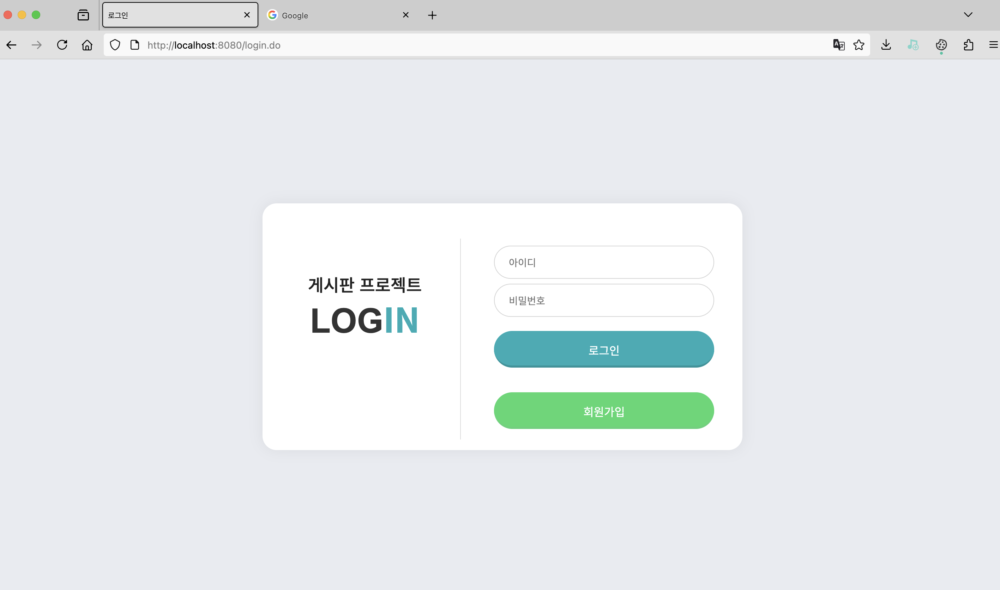

## 2. 회원가입 기능 추가 및 DB에 저장하여 중복 아이디 생성 불가

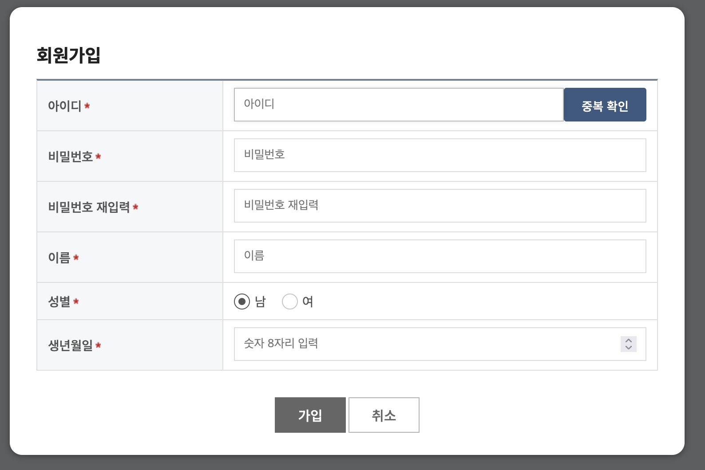
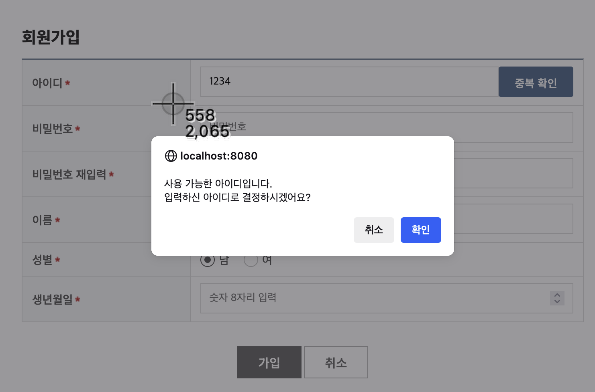
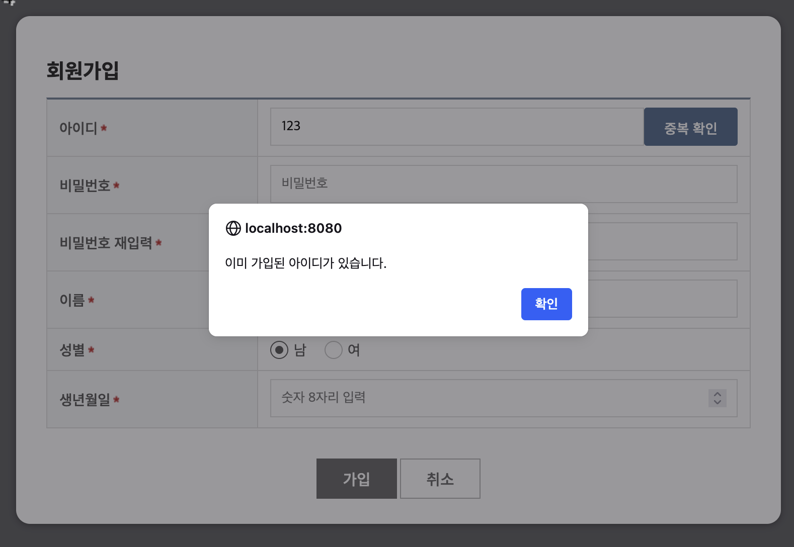

## 3. 로그인 시 게시판 1페이지로만 가게 구현

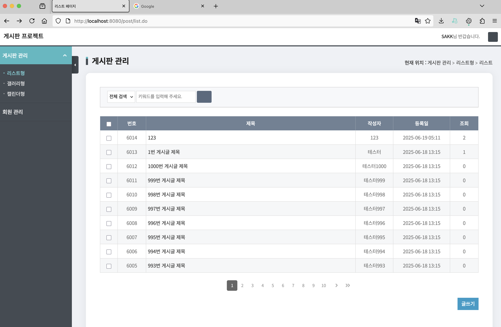

## 4. 글 작성 또는 댓글 작성 시 DB에 저장 클릭 시 조회 수 증가 구현

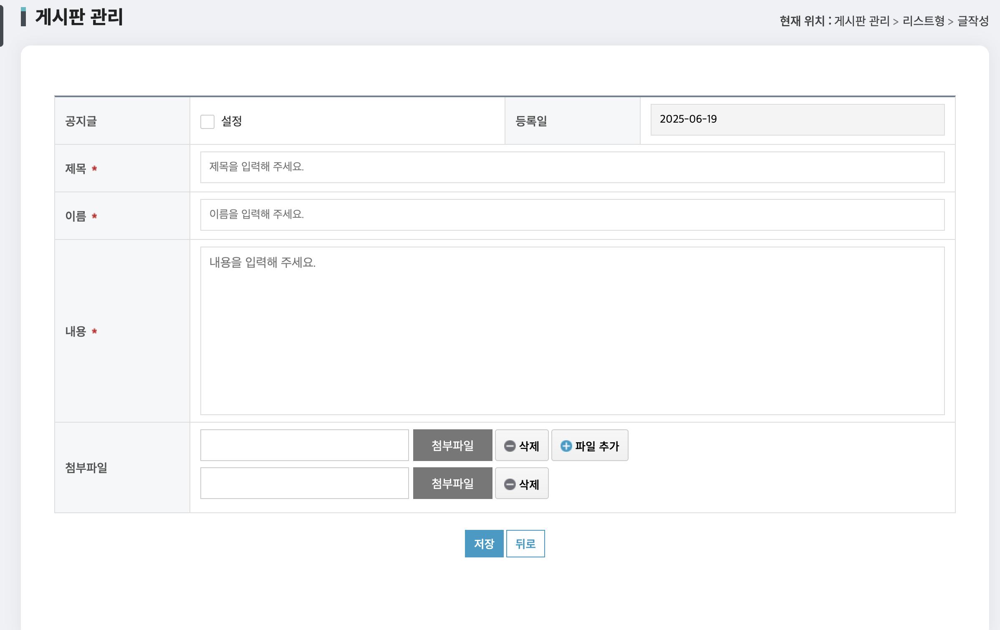
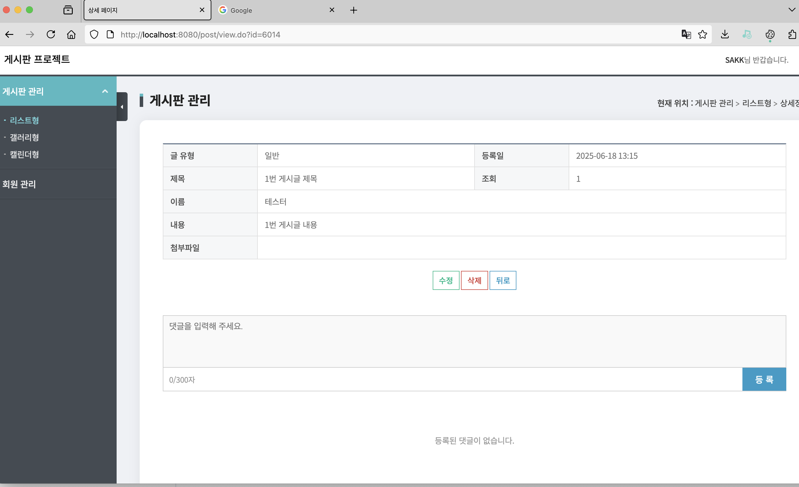
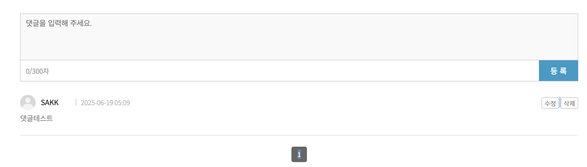

## 5. 글 작성 시 파일 또는 다중파일를 첨부할 시 DB에 파일 저장

 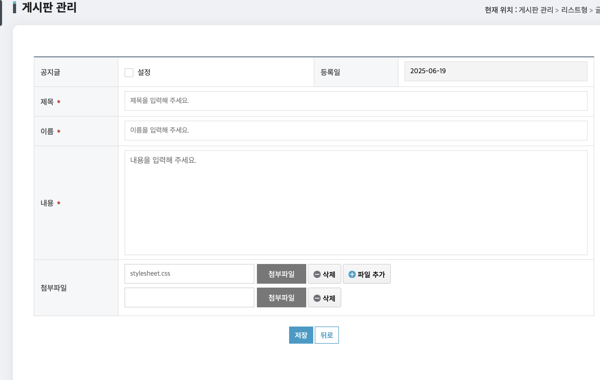
 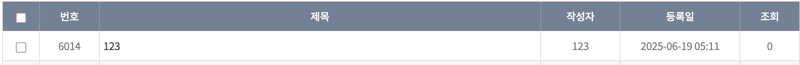

## 6. 파일 다운로드 할 수 있게끔 구현

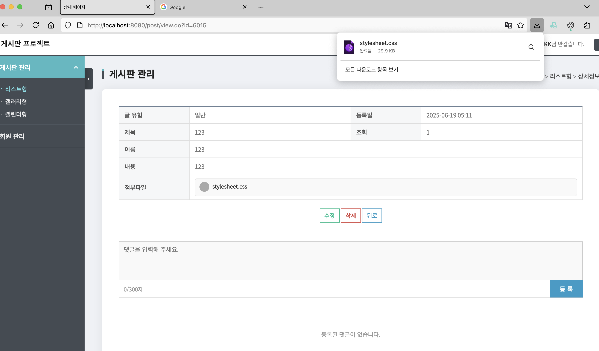

## 프로젝트 느낀 점

### 1. DB와 CRUD간에 mapper로 연결하여 따로 관리를 하는 것이 힘든 과정이였다.

### 2. 이렇게 기능에 따라 CRUD를 함으로써 데이터 무결성 유지를 하고 좀 더 효율적으로 관리하기 편하다고 배운 프로젝트였다.

